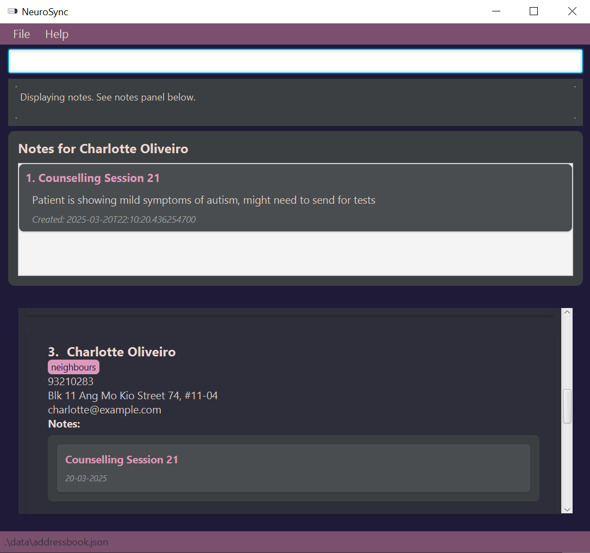

[](https://codecov.io/gh/nus-cs2103-AY2425S2/tp)

[](https://github.com/AY2425S2-CS2103T-F13-1/tp/actions)
# NeuroSync: All-In-One app for Psychiatrists!


NeuroSync is a **all-in-one platform** to keep track of patients’ _contacts_, _details_ and _notes_ from their sessions. No more searching and ruffling through thick files of paper - simply type in a patient's name and see all their details at a glance!

**Target Users:** Psychiatrists who have to keep track of a lot of patients’ details and session notes

**How to run:**
  1. Download our latest release
  2. In your terminal, navigate to project directory and key in: ```java -jar neuroSync.jar```
  3. Enjoy!


For the detailed documentation of this project, see the **[NeuroSync Product Website](https://ay2425s2-cs2103t-f13-1.github.io/tp/)**.<br>
This project is based on the AddressBook-Level3 project created by the [SE-EDU initiative](https://se-education.org) <br>
This project is a **part of the se-education.org** initiative. If you would like to contribute code to this project, see [se-education.org](https://se-education.org/#contributing-to-se-edu) for more info.
