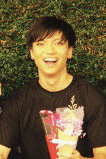
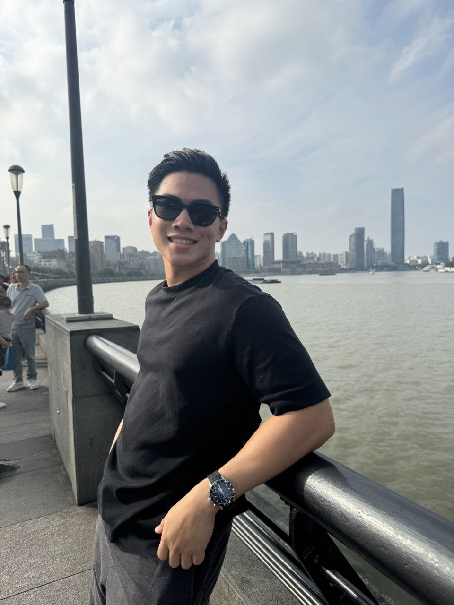

We are a team based in the [School of Computing, National University of Singapore](https://www.comp.nus.edu.sg).

You can reach us at the email `seer[at]comp.nus.edu.sg`

## Project team

### Wong Yu Zhang

[[homepage](https://fieash.github.io/)]
[[github](https://github.com/fieash)]
[[portfolio](team/yuzhangWong.md)]

- Role: Project Advisor

### Benedict Lee

[[github](http://github.com/benedictleejr)]
[[portfolio](team/benedictLee.md)]

- Role: 10x Developer, Code Quality :police_car:
- Responsibilities: Full-Stack Development

### Daniel Goh

[[github](http://github.com/danplatypus30)]
[[portfolio](team/danielGoh.md)]

- Role: Developer
- Responsibilities: UI, Git Gud Engineer

### Andre Chia

[[github](http://github.com/andrechia)]
[[portfolio](team/andrechia.md)]

- Role: Principle Prompt Engineer
- Responsibilities: Report Writing, User Experience

### Jin Diyue

[[github](https://github.com/Golddirio)]
[[portfolio](team/golddirio.md)]

- Role: Developer
- Responsibilities: Full stack development
