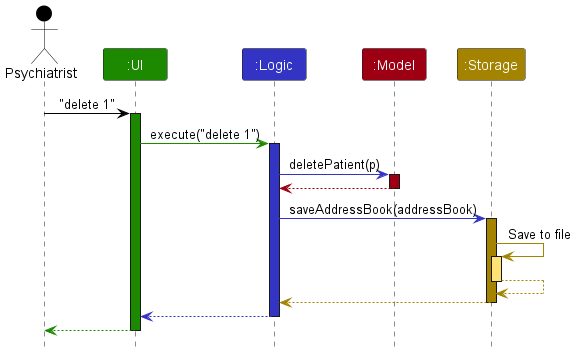
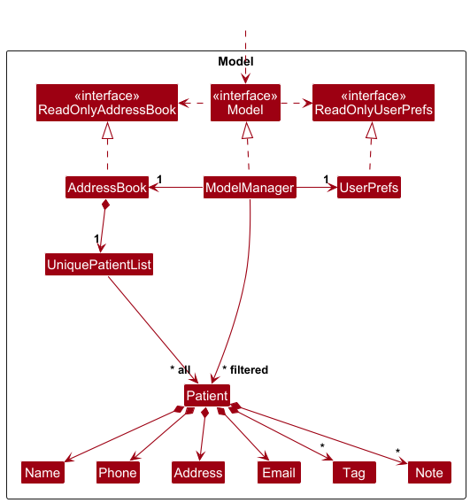
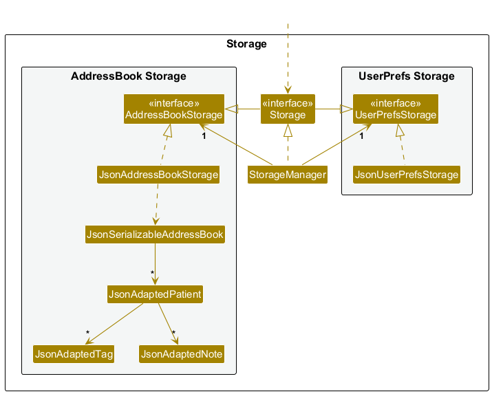
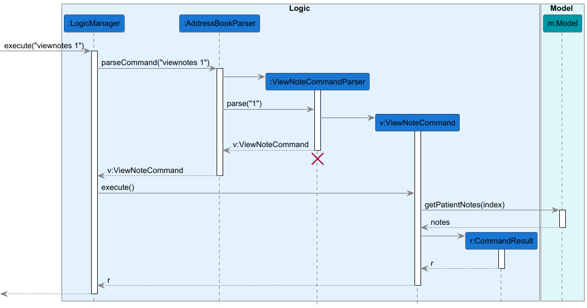
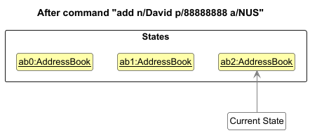
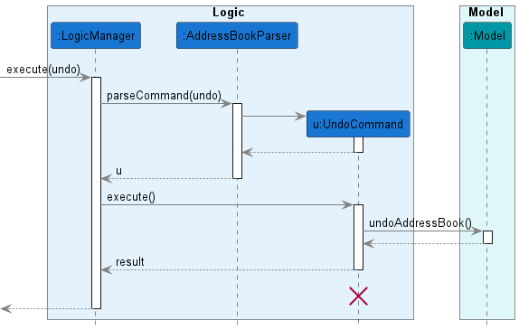
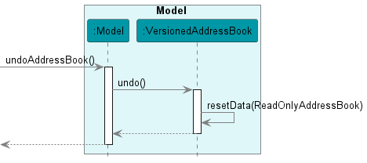

# **Welcome to the NeuroSync Developer Guide!**

## Table of Contents {#table-of-contents}

- [Introduction](#introduction)
- [Design](#design)
  - [Architecture](#architecture)
  - [Logic Component](#logic-component)
  - [Model Component](#model-component)
  - [Storage Component](#storage-component)
  - [UI Component](#ui-component)
  - [Common Classes](#common-classes)
- [Implementation](#implementation)
  - [Patient Management](#patient-management)
  - [Notes Feature](#notes-feature)
  - [Undo/Redo Feature](#undoredo-feature)
- [Documentation](#documentation)
- [Testing](#testing)

- [Appendix](#appendix)
  - [Glossary](#glossary)
  - [User Stories](#user-stories)
  - [Use Cases](#use-cases)
  - [Instructions for Manual Testing](#instructions-for-manual-testing)
  - [Effort](#effort)
  - [Planned Enhancements](#planned-enhancements)
  - [Requirements](#requirements)
  - [API Reference](#api-reference)
  - [Troubleshooting](#troubleshooting)
---

## Introduction

NeuroSync is a desktop application designed for psychiatrists to manage patient records and session notes efficiently. This guide provides detailed technical information for developers who want to understand the codebase and contribute to the project.

### Purpose

This developer guide aims to:

- Help new developers understand the codebase structure
- Document implementation details of key features
- Provide guidelines for testing and maintenance
- Serve as a reference for future development

### How to Use This Guide

1. Start with the [Setting Up](#setting-up) section if you're new to the project
2. Read through the [Design](#design) section to understand the architecture
3. Refer to specific sections in [Implementation](#implementation) for detailed feature documentation
4. Use the [Appendix](#appendix) for reference materials and troubleshooting

### Getting Help

If you need assistance:

- Check the [Troubleshooting](#troubleshooting) section in the Appendix
- Review existing GitHub issues
- Contact the development team


### Setting Up

For detailed setup instructions, please refer to the [Getting Started](UserGuide.md#getting-started) section in our [User Guide](UserGuide.md).

[🔝 Back to Top](#table-of-contents)

---

## Design

### Architecture


The architecture follows a component-based design with clear separation of concerns. Each component is designed to be modular and maintainable.

#### Core Components

- **Logic**: Processes commands and business logic
- **Model**: Manages data and state
- **Storage**: Handles data persistence
- **UI**: Handles user interaction and display
- **Common Classes**: Shared utilities and helpers

#### Component Interactions

The sequence diagram below shows how components interact when processing a `delete 1` command:



Each component:

- Defines its API in an `interface` with the same name as the component
- Implements functionality using a concrete `{Component Name}Manager` class
- Interacts with other components through their interfaces rather than concrete classes

[🔝 Back to Top](#table-of-contents)

---

## Logic Component

The Logic component handles command processing and business rules.

#### Command Flow

1. User enters command through UI
2. `LogicManager` receives command
3. `AddressBookParser` parses command
4. Appropriate command class executes
5. Results returned through component chain

#### Key Classes

The Logic component uses a command pattern for handling different operations. Here's how it works:

1. **Command Classes**:

   - `Command`: Abstract base class for all commands
   - Specific implementations like:
     - `AddCommand`: Adds a new patient
     - `DeleteCommand`: Removes a patient
     - `EditCommand`: Modifies patient details
     - `NoteCommand`: Adds/manages patient notes
     - `ListCommand`: Shows all patients

2. **Parser Classes**:
   

   - `Parser`: Interface that all command parsers implement
   - Specific implementations like:
     - `AddCommandParser`: Parses add command arguments
     - `DeleteCommandParser`: Parses delete command index
     - `NoteCommandParser`: Parses note command arguments

The term "XYZ" in the documentation represents a placeholder for specific command names. For example:

- `XYZCommand` could be `AddCommand`, `DeleteCommand`, etc.
- `XYZCommandParser` could be `AddCommandParser`, `DeleteCommandParser`, etc.

[🔝 Back to Top](#table-of-contents)

---

## Model Component

#### Model Structure

The Model component manages application data and state.

#### Key Features

- Stores address book data
- Maintains filtered lists
- Manages user preferences
- Handles patient notes
- Implements undo/redo

#### Data Structures

- `UniquePatientList`: Core patient storage
- `TreeSet<Note>`: Ordered note storage
- `VersionedAddressBook`: Undo/redo support

#### Component API

```java
public interface Model {
    void addPatient(Patient patient);
    void deletePerson(Patient target);
    void updateFilteredPatientList(Predicate<Patient> predicate);
    void commitAddressBook();
}
```



The Model component maintains:

- Patient data in `UniquePatientList`
- User preferences in `UserPrefs`
- Filtered patient views
- Note management system

[🔝 Back to Top](#table-of-contents)

---

## Storage Component

The Storage component handles data persistence.

#### Features

- JSON-based storage
- Automatic saving
- Data validation
- Backup support

#### Key Classes

- `Storage`: Main component interface
- `JsonAddressBookStorage`: Address book storage
- `JsonUserPrefsStorage`: User preferences storage
- `JsonAdaptedPatient`: JSON serialization

#### Component API

```java
public interface Storage {
    Path getAddressBookFilePath();
    Optional<ReadOnlyAddressBook> readAddressBook();
    void saveAddressBook(ReadOnlyAddressBook addressBook);
}
```

#### Storage Integration



The Storage component provides JSON-based persistence with:

- `JsonAddressBookStorage`: Handles patient data
- `JsonUserPrefsStorage`: Manages user preferences
- `JsonAdaptedPatient`: Converts between JSON and Patient objects

[🔝 Back to Top](#table-of-contents)

---

## UI Component

The UI component manages all user-facing elements of the application.

#### Key Classes

- `MainWindow`: The root UI container
- `CommandBox`: Handles command input
- `ResultDisplay`: Shows command results
- `PatientListPanel`: Displays patient list
- `NotesDisplayPanel`: Shows patient notes
- `StatusBarFooter`: Displays status information

#### Implementation

The UI:

- Uses JavaFX framework
- Defines layouts in `.fxml` files under `src/main/resources/view`
- Follows MVVM pattern for data binding
- Implements responsive design principles
- Uses custom styling defined in `styles.css`

#### Component API

```java
public interface Ui {
    /** Starts the UI (and the App). */
    void start(Stage primaryStage);

    /** Returns the primary stage. */
    Stage getPrimaryStage();
}
```

[🔝 Back to Top](#table-of-contents)

---

## Common Classes

Classes used across multiple components:

- `LogsCenter`: Centralized logging
- `Config`: Application configuration
- `StringUtil`: String manipulation utilities
- `CollectionUtil`: Collection helpers

[🔝 Back to Top](#table-of-contents)

---

## Implementation

This section describes the implementation details of key features in NeuroSync.

### Patient Management

The patient management system is the core functionality of NeuroSync.

#### Features

- Adding new patients
- Editing patient information
- Deleting patients
- Viewing patient details
- Search and filter capabilities

#### Implementation Details

```java
public class Patient {
    private final Name name;
    private final Phone phone;
    private final Address address;
    private final Set<Tag> tags;
    private final TreeSet<Note> notes;
    // ...
}
```

The `Patient` class is immutable, ensuring thread safety and preventing accidental modifications.

#### Notable Design Considerations

**Aspect: Patient Data Storage**

- **Alternative 1 (current choice)**: Store all patient data in memory
  - Pros: Fast access and modifications
  - Cons: Limited by available memory
- **Alternative 2**: Store patient data in database
  - Pros: Can handle large datasets
  - Cons: More complex setup, slower access

---

### Notes Feature

The notes system allows psychiatrists to maintain detailed records of patient sessions.

#### Command Flow: Add Note


1. User enters: `note 1 nt/Session 1 nc/Patient anxious`
2. `LogicManager` receives command
3. `AddressBookParser` creates `NoteCommandParser`
4. Parser validates and creates `NoteCommand`
5. Command executes and updates model

#### Command Flow: View Notes



1. User enters `viewnote 1` command
2. Command parsed and validated
3. Patient retrieved from model
4. Notes fetched and sorted
5. Results displayed to user

#### Implementation Details

```java
public class Note implements Comparable<Note> {
    private final String title;
    private final String content;
    private final LocalDateTime createdAt;

    @Override
    public int compareTo(Note other) {
        return createdAt.compareTo(other.createdAt);
    }
}
```

Notes are automatically sorted by creation date using a `TreeSet`.

#### Notable Design Considerations

**Aspect: Note Storage Structure**

- **Alternative 1 (current choice)**: Store notes within Patient object
  - Pros: Direct access, simpler implementation
  - Cons: Larger memory footprint
- **Alternative 2**: Store notes separately with references
  - Pros: Memory efficient
  - Cons: More complex querying

[🔝 Back to Top](#table-of-contents)

---

### Undo/Redo Feature

The undo/redo mechanism allows users to reverse or reapply changes. This feature is implemented using command pattern and state management.

#### State Management Implementation

The undo/redo feature uses state management to track changes in the address book. Below are the different states and transitions:

##### Initial State


- When the app launches, it starts with a single address book state
- Current state pointer points to the initial state

##### After `delete 5` Command


- A new `AddressBook` state is created
- Current state pointer is moved to the new state
- Previous state is preserved for potential undo

##### After `add n/David` Command



- Another new `AddressBook` state is created
- Current state pointer moves to this new state
- All previous states are preserved in sequence

##### After `undo` Command


- Current state pointer moves back to previous state
- State is restored to before `add n/David` was executed
- Most recent state is preserved for potential redo

##### After `list` Command


- List command does not modify address book state
- Current state pointer remains unchanged
- No new state is created

##### After `clear` Command


- New state is created with empty address book
- Current state pointer moves to new state
- All previous states are preserved for potential undo

#### Implementation Details

The feature is implemented using the `VersionedAddressBook` class:

```java
public class VersionedAddressBook extends AddressBook {
    private List<ReadOnlyAddressBook> addressBookStateList;
    private int currentStatePointer;

    public void commit() {
        // Save current state
    }

    public void undo() {
        // Restore previous state
    }

    public void redo() {
        // Restore next state
    }
}
```

#### Command Processing Flow

The sequence diagrams below illustrate how undo/redo commands are processed:

##### Logic Component Handling



- Shows how the Logic component processes the undo command
- Demonstrates interaction between command classes and model

##### Model Component Handling



- Shows how the Model component handles state changes
- Illustrates state pointer management during undo operations

#### Design Considerations

**Aspect: State Storage Method**

- **Alternative 1 (current choice)**: Store full states
  - Pros: Simple implementation, reliable
  - Cons: Higher memory usage
- **Alternative 2**: Store command history
  - Pros: Memory efficient
  - Cons: Complex implementation, potential bugs

[🔝 Back to Top](#table-of-contents)

---

## Documentation

Documentation is crucial for maintaining and extending NeuroSync. We maintain two key documents:

1. **Developer Guide** (this document): Technical documentation for developers
2. [**User Guide**](UserGuide.md): End-user documentation

### Documentation Maintenance

- Keep documentation synchronized with code changes
- Update diagrams when architecture changes
- Include code examples for key features
- Maintain clear formatting and structure

### Diagrams

The following UML diagrams illustrate NeuroSync's architecture and components:

1. **Architecture Overview**:

   - [Architecture Diagram](diagrams/ArchitectureDiagram.puml) - High-level system architecture
   - [Architecture Sequence Diagram](diagrams/ArchitectureSequenceDiagram.puml) - Component interactions

2. **Component Details**:

   - [UI Class Diagram](diagrams/UiClassDiagram.puml) - UI component structure and relationships
   - [Model Class Diagram](diagrams/ModelClassDiagram.puml) - Model component classes and associations
   - [Storage Class Diagram](diagrams/StorageClassDiagram.puml) - Storage component organization

3. **Feature Implementations**:
   - [Add Note Sequence Diagram](diagrams/AddNoteSequenceDiagram.puml) - Note creation process flow

Each diagram is accompanied by detailed explanations in their respective sections.

[🔝 Back to Top](#table-of-contents)

---

## Testing

To run all tests, use:

```
./gradlew test
```

To write new tests:

1. Create a new test class in the `src/test/java` directory
2. Annotate test methods with `@Test`
3. Follow the naming convention: `{MethodName}_{TestScenario}_expectedBehavior`
   Example: `delete_validIndex_success()`

To check test coverage:

```
./gradlew jacocoTestReport
```

The report will be generated in `build/reports/jacoco/test/html/index.html`

To run specific test classes:

```
./gradlew test --tests "seedu.address.logic.commands.AddCommandTest"
```

[🔝 Back to Top](#table-of-contents)

---

## Appendix

### Glossary

| Term                 | Definition                                                                                                               |
| -------------------- | ------------------------------------------------------------------------------------------------------------------------ |
| API                  | Application Programming Interface - A set of definitions and protocols for building and integrating application software |
| AddressBook          | The core data structure that stores all patient information in NeuroSync                                                 |
| CLI                  | Command Line Interface - A text-based interface for interacting with the application                                     |
| Component            | A major architectural unit in the application (e.g., UI, Logic, Model, Storage)                                          |
| FXML                 | XML-based user interface markup language used with JavaFX                                                                |
| GUI                  | Graphical User Interface - The visual interface of the application                                                       |
| JavaFX               | A software platform for creating desktop applications, used for NeuroSync's UI                                           |
| JSON                 | JavaScript Object Notation - A lightweight data format used for data storage                                             |
| MVVM                 | Model-View-ViewModel - The architectural pattern used in the UI component                                                |
| Parser               | A component that converts user input text into command objects                                                           |
| Patient              | An individual seeking psychiatric treatment, the main entity in the system                                               |
| State                | The condition of the system at a specific point in time (used in undo/redo)                                              |
| UI                   | User Interface - All components that handle user interaction                                                             |
| UML                  | Unified Modeling Language - Standardized modeling language used in software engineering                                  |
| Undo/Redo            | Feature that allows reverting or reapplying previous commands                                                            |
| VersionedAddressBook | Extended AddressBook that supports undo/redo operations                                                                  |

### Technical Terms

| Term      | Definition                                                      |
| --------- | --------------------------------------------------------------- |
| Exception | An error that occurs during program execution                   |
| Gradle    | Build automation tool used for building and testing the project |
| Interface | A contract that specifies what methods a class must implement   |
| JUnit     | Testing framework used for unit testing                         |

### Domain-Specific Terms

| Term           | Definition                                                                |
| -------------- | ------------------------------------------------------------------------- |
| Note           | A record of a patient session, including observations and treatment plans |
| Session        | A meeting between psychiatrist and patient                                |
| Treatment      | Medical care provided to a patient                                        |
| Diagnosis      | Identification of a mental health condition                               |
| Prescription   | Medical treatment ordered for a patient                                   |
| Follow-up      | Subsequent appointment to monitor patient progress                        |

[🔝 Back to Top](#table-of-contents)

### User Stories

As a psychiatrist, I can view all the patients' information including name, phone number,address so that it is easier for me to have a quick view of all the patients I have.

As a psychiatrist, I can easily add new patients to the app, so that I can maintain an organized record of my patients.

As a psychiatrist having many patients, I can easily search for a patient in the list by inputting any 
user information (name, phone, address), so that I can get their details or view their meeting notes.

As a psychiatrist in a consultation session with a patient, I can take note of information
about this session, so that I can refer to it during the patient's next visit.

As a psychiatrist preparing for my next consultation session, I can view all the notes
of the upcoming patient, so that I can recall any important information about this patient.

### Appendix: Effort

Difficulty level: Moderate, twice as hard as Individual Project

Challenges faced:
- Reading through and understanding AB3 codes, many layers of abstraction, many unfamiliar models, classes, methods
- Implementing new commands, was difficult finding where to add various chunks of code, many classes from all over the application had to be changed, tests had to be added
- Git workflows, merge conflicts, so many additional steps to make sure things go smoothly

Effort required: High

Achievements of the project:
- Very familiar with git workflows now, comfortable working on team projects iteratively
- Learnt and appreciated the abstractions of code in AB3, even though it looks like a lot of redundant work for such a simple application, it made sure that everything ran smoothly and greatly reduced the potential number of bugs
- Learnt about proper documentation and standard conventions in code and git

### Planned Enhancements

- Support for various languages including right-justified languages
- Adding of NRIC numbers and masking it

### Appendix: Requirements

System Requirements:
- Java: Version 17
- Compatibility: Windows, macOS, Linux

#### Non-Functional Requirements

- The application should load the main interface within 10 seconds on standard hardware.
- Searching for a patient should return results in under 1 second for up
to 10,000 contacts.
- The response to any use action should become visible within 5 seconds.
- The user interface should be intuitive enough for users who are not IT-savvy.

### API Reference

- [NeuroSync API](https://api.neurosynctest.com)

### Troubleshooting

If you encounter issues, please:

- Check the [NeuroSync GitHub issues](https://github.com/se-edu/addressbook-level3/issues)
- Contact the development team

[🔝 Back to Top](#table-of-contents)

