# **Welcome to the NeuroSync User Guide!**
NeuroSync helps psychiatrists **manage patient records and session notes efficiently**. Choose a topic below to get step-by-step instructions, troubleshoot issues, and maximize your productivity!

  

## 💡 **Core Features** {#core-features}

- 📁 **Manage Patient Records** - Add, edit, and delete patient details.
- 📝 **Session Notes** - Keep track of discussions, diagnoses, and treatments.
- 🔎 **Powerful Search & Filters** - Quickly retrieve any patient or note.
- ⚡ **Command-Based Interface** - Fast, efficient, and easy to use.


## 📜 Table of Contents {#table-of-contents}
1. [Introduction](#introduction)
2. [Getting Started](#getting-started)
3. [Core Features](#core-features)
4. [Command Summary](#command-summary)
5. [Commands & Usage](#commands--usage)
    - **Patient Management Commands**
      - [View All Patients](#listing-patients)
      - [Finding a Patient](#finding-a-patient)
      - [Adding a Patient](#adding-a-patient)
      - [Editing a Patient](#editing-a-patient)
      - [Deleting a Patient](#deleting-a-patient)
    - **Note Management Commands**
      - [Viewing Notes](#viewing-notes)
      - [Filtering Notes](#filtering-notes)
      - [Adding a Note](#adding-a-note)
      - [Edit a Note](#editing-a-note)
      - [Delete a Note](#deleting-a-note)
    - **General Commands**
      - [Undo](#undo)
      - [Redo](#redo)
      - [Clear All Data](#clear-data)
      - [Help](#help)
6. [FAQs & Troubleshooting](#faqs--troubleshooting)
7. [Technology Stack](#technology-stack)
8. [Acknowledgemets](#acknowledgements)
9. [Contact & Support](#contact-support)

---
<div style="page-break-after: always;"></div>

## 📢 **Introduction** {#introduction}

### What does NeuroSync do?

NeuroSync **keeps track of patient details and session notes effortlessly**. No more searching through paper files—find what you need **instantly** using powerful search and filter commands.

**Why Use NeuroSync?**<br>
✅ **Fast & Simple** - No unnecessary clicks, just type commands.<br>
✅ **Powerful Search & Filters** - Retrieve patient data in seconds.<br>
✅ **Organized & Secure** - Keep confidential data well-structured.

[🔝 Back to Top](#table-of-contents)

---

## 🚀 **Getting Started** {#getting-started}

### **1️⃣ Download & Install**

1. Download the latest release from [NeuroSync Releases](https://github.com/AY2425S2-CS2103T-F13-1/tp/releases).
2. Move the downloaded jar file to your preferred folder where you'd like to store your NeuroSync app
3. Check your Java version:
- NeuroSync runs exclusively on Java version 17
- To check your Java version, you can follow this [tutorial](https://www.java.com/en/download/help/version_manual.html)

4. Open NeuroSync:
- For Windows:
  * Open the folder where NeuroSync is saved
  * Hold shift, right-click in the folder, select "Open Command Window Here"
  * Type the following command and press Enter.
  ```bash
  java -jar NeuroSync.jar
  ```
  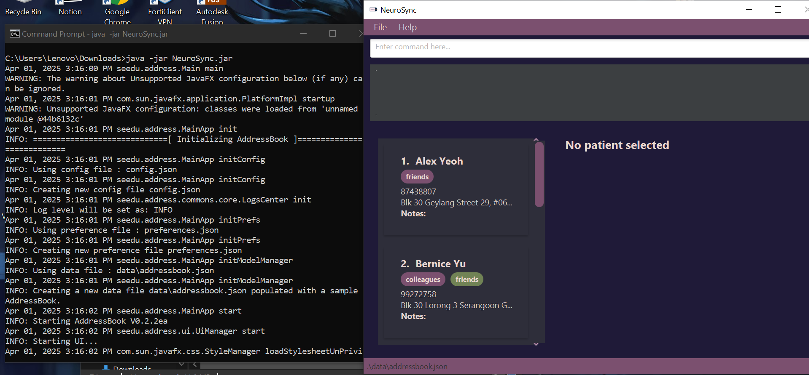
- For Mac:
  * Press `Command (⌘) + Space` to open spotlight search, search for Terminal and open it
  * Type `cd` (followed by a space), then drag and drop the folder where NeuroSync is saved into the Terminal window
  * Press Enter, then type:
  ```bash
  java -jar NeuroSync.jar
  ```
  * Press Enter

5. You can now use NeuroSync!


### **2️⃣ System Requirements**

- **Java**: Version 17
- **OS Compatibility**: Windows, macOS, Linux

[🔝 Back to Top](#table-of-contents)

---
<div style="page-break-after: always;"></div>

## 🧭 **Command Summary** {#command-summary}

| **Action**                            | **Command Syntax**                                                         |
|---------------------------------------|----------------------------------------------------------------------------|
| [List Patients](#listing-patients)    | `list`                                                                     |
| [Find Patient](#finding-a-patient)    | `find KEYWORD [MORE_KEYWORDS]`<br>`find yu`                              |
| [Add Patient](#adding-a-patient)      | `add n/NAME p/PHONE_NUMBER a/ADDRESS [t/TAG]…​`<br>`add n/John Doe p/98005442 a/123 Clementi Street t/ADHD` |
| [Edit Patient](#editing-a-patient)    | `edit INDEX [n/NAME] [p/PHONE_NUMBER] [a/ADDRESS] [t/TAG]…​`<br>`edit 1 p/91234567` |
| [Delete Patient](#deleting-a-patient) | `delete INDEX`<br>`delete 1` |
| [View Notes](#viewing-notes)          | `viewnotes INDEX or viewnotes all`<br>`viewnotes 1 or viewnotes all` |
| [Filter Note](#filtering-notes)       | `filternote INDEX nt/TITLE_KEYWORD`<br>`filternote 1 nt/anxiety` |
| [Add Note](#adding-a-note)            | `note INDEX nt/TITLE nc/CONTENT`<br>`note 1 nt/Mood Assessment nc/Discussed mood swings and coping strategies.` |
| [Edit Note](#editing-a-note)          | `editnote INDEX nt/TITLE nc/CONTENT`<br>`editnote 1 nt/Mood Assessment nc/Updated content with more details.` |
| [Delete Note](#deleting-a-note)       | `deletenote INDEX nt/TITLE`<br>`deletenote 1 nt/Mood Assessment` |
| [Undo](#undo)                         | `undo`                                                                     |
| [Redo](#redo)                         | `redo`                                                                     |
| [Clear Data](#clear-data)             | `clear`                                                                    |
| [Help](#help)                         | `help`                                                                     |


<div markdown="block" class="alert alert-info">

**:information_source: Notes about the command format:**<br>

* Words in `UPPER_CASE` are the parameters to be supplied by the user.<br>
  e.g. in `add n/NAME`, `NAME` is a parameter which can be used as `add n/John Doe`.

* Items in square brackets are optional.<br>
  e.g `n/NAME [t/TAG]` can be used as `n/John Doe t/ADHD` or as `n/John Doe`.

* Items with `…`​ after them can be used multiple times including zero times.<br>
  e.g. `[t/TAG]…​` can be used as ` ` (i.e. 0 times), `t/ADHD`, `t/ADHD t/Depression` etc.

* Parameters can be in any order.<br>
  e.g. if the command specifies `n/NAME p/PHONE_NUMBER`, `p/PHONE_NUMBER n/NAME` is also acceptable.

* Extraneous parameters for commands that do not take in parameters (such as `help`, `list`, `exit` and `clear`) will be ignored.<br>
  e.g. if the command specifies `help 123`, it will be interpreted as `help`.

* If you are using a PDF version of this document, be careful when copying and pasting commands that span multiple lines as space characters surrounding line-breaks may be omitted when copied over to the application.

* For commands with the `INDEX` parameter, `INDEX` refers to the numbers from the **list of patients currently displayed**. Check that you are giving a valid index for the currently displayed list!

* For commands with the `INDEX` parameter, if you enter the index as `0` or a number longer than 10 digits, the error message will tell you `Invalid command format!`. Doublecheck that you are giving a valid index for the currently displayed list!
</div>

[🔝 Back to Top](#table-of-contents)

---
<div style="page-break-after: always;"></div>

## 🎯 **Commands & Usage** {#commands--usage}

Each command is designed to make patient and session management **fast and intuitive**.

### **Listing Patients** {#listing-patients}
You can view all patients using the `list` command!

**Example:**

```bash
list
```

✔️ **Expected Output:**

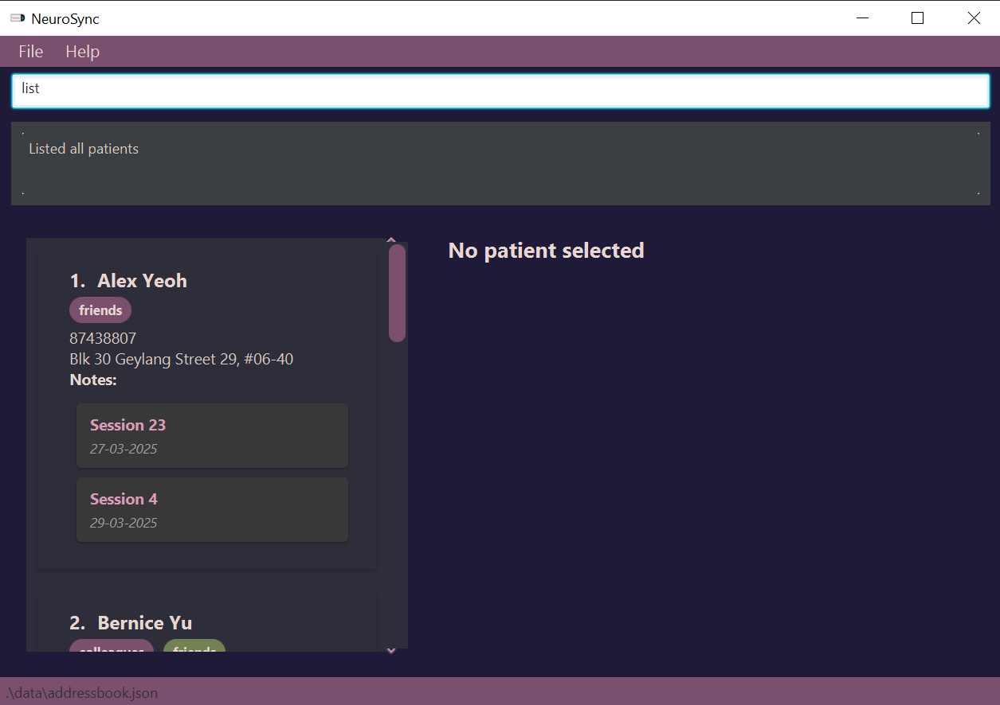

⚠️ **Warning:** This will show all patients, so be mindful if you have a large list.<br>
💡 **Tip:** Use the [Find](#finding-a-patient) command to quickly locate a patient.

[🔝 Back to Top](#table-of-contents)

---

### **Finding a Patient** {#finding-a-patient}
You can find a specific patient by their name,
phone number or address, using the `find` command.

```bash
find KEYWORD [MORE_KEYWORDS]
```

**Example:**

```bash
find yu
```

✔️ **Expected Output:**

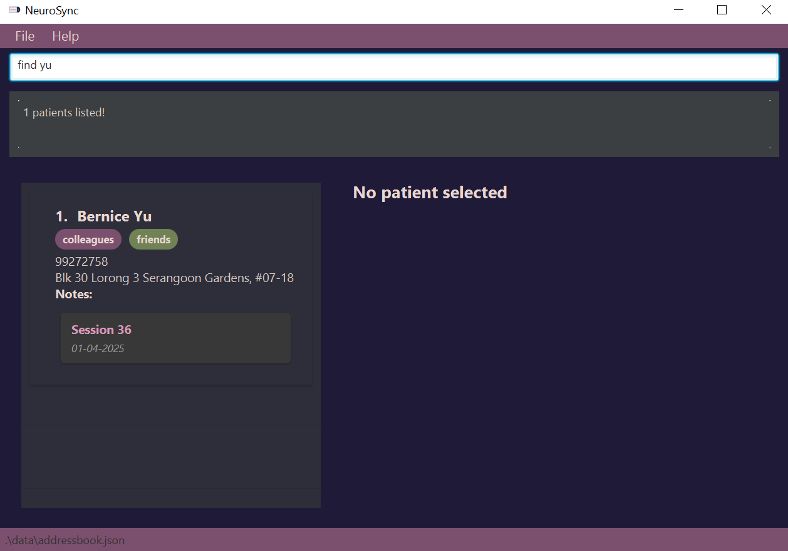

⚠️ **Warning:** Multiple matches may be returned if you use a common name.<br>
💡 **Tip:** Use specific names or words to narrow your search.

[🔝 Back to Top](#table-of-contents)

---
<div style="page-break-after: always;"></div>

### **Adding a Patient** {#adding-a-patient}
You can add new patients using their name, phone number, and address.

```bash
add n/NAME p/PHONE_NUMBER a/ADDRESS [t/TAG]…​
```

**Example:**

```bash
add n/John Doe p/98005442 a/123 Clementi Street t/ADHD
```

✔️ **Expected Output:**

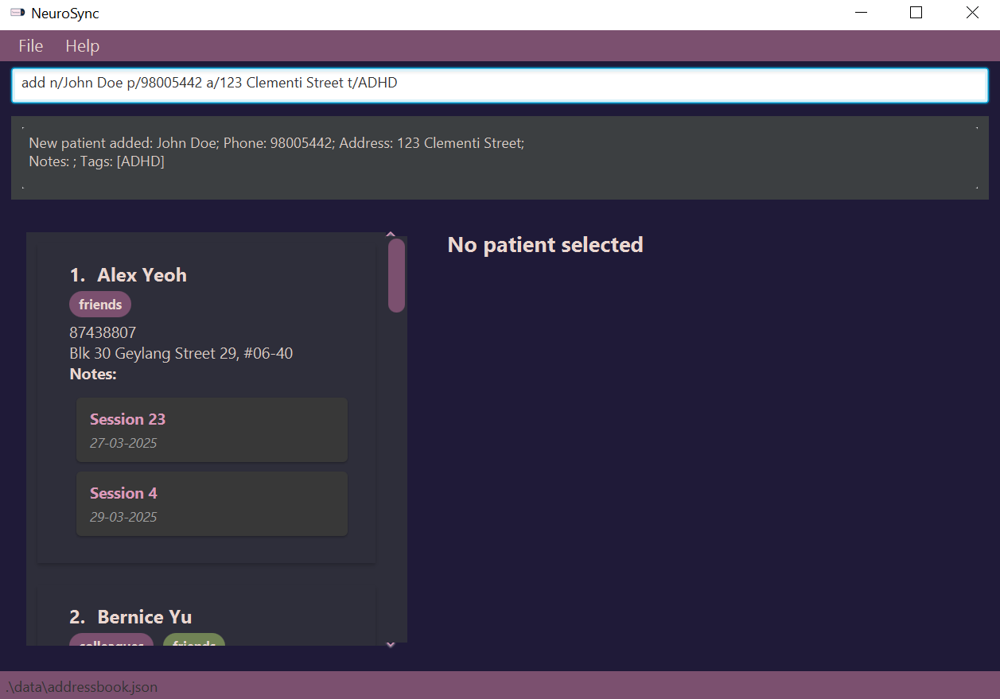

⚠️ **Warning:** Duplicate patient names are not allowed, for clarity.

💡 **Tip:** 
Use **tags** (`t/`) to categorize patients (e.g., `t/Anxiety`). Duplicate tags (case-insensitive) will be auto-filtered to only preserve the first instance seen.

**Example:**
```bash
add n/John Doe p/98005442 a/123 Clementi Street t/ADHD t/adhd t/Anxiety t/ANXIETY
```
In this example, only the tags `ADHD` and `Anxiety` will be preserved.

>💡 **Tip: Name Constraints**<br>
> Names should only contain alphabets, numbers, spaces, and certain special characters `,.'-`<br>
> Additionally, `s/o` and `d/o` are allowed between names (e.g, `Ridwan s/o Mista`)


[🔝 Back to Top](#table-of-contents)

---
<div style="page-break-after: always;"></div>

### **Editing a Patient** {#editing-a-patient}
You can change a patient's information using the `edit` command!

```bash
edit INDEX [n/NAME] [p/PHONE_NUMBER] [a/ADDRESS] [t/TAG]…​
```

**Example:**

```bash
edit 1 p/91234567
```

✔️ **Expected Output:**

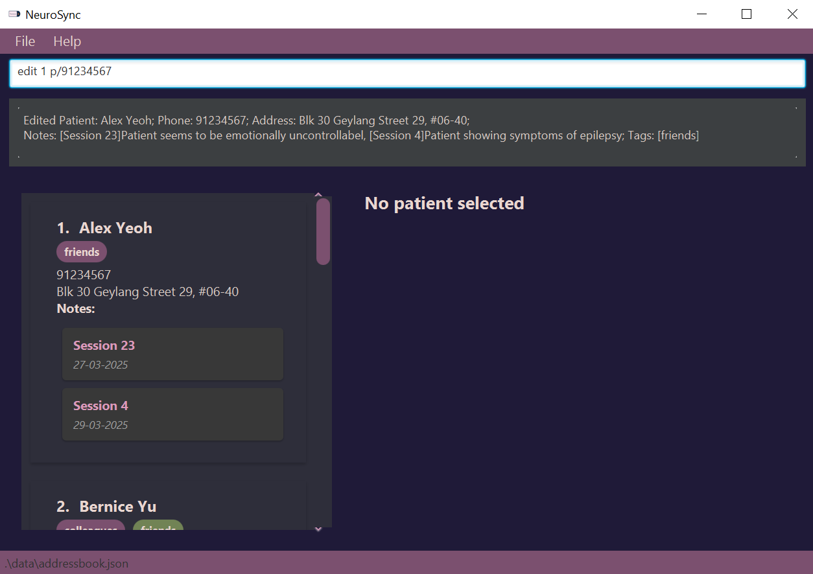


⚠️ **Warning:** Only update fields that need changing to avoid accidental edits.<br>
💡 **Tip:** You can edit just one piece of data, e.g, only the phone number. <br>
💡 **Tip:** You may also use **tags** (`t/`) to categorize patients (e.g., `t/Anxiety`). Duplicate tags (case-insensitive) will be auto-filtered to only preserve the first instance seen.

**Example:**
```bash
add n/John Doe p/98005442 a/123 Clementi Street t/ADHD t/adhd t/Anxiety t/ANXIETY
```
In this example, only the tags `ADHD` and `Anxiety` will be preserved.

[🔝 Back to Top](#table-of-contents)

---
<div style="page-break-after: always;"></div>

### **Deleting a Patient** {#deleting-a-patient}
After a patient recovers, you can delete them from NeuroSync using the index number listed next to their name.

📝 **Note**: Deleting a patient also deletes all of their notes.


```bash
delete INDEX
```

**Example:**

```bash
delete 3
```

✔️ **Expected Output:**

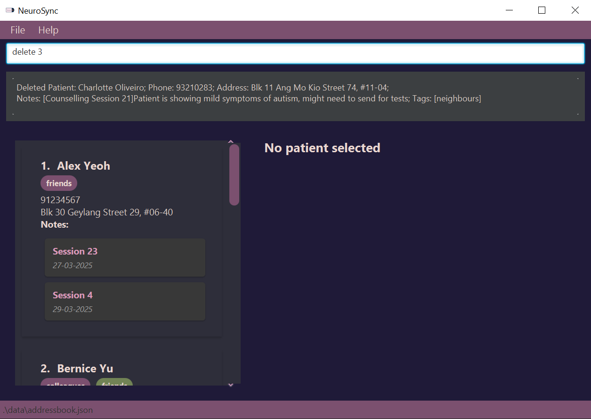


💡 **Tip:** You can undo a delete using the [undo](#undo) command!

[🔝 Back to Top](#table-of-contents)

---
<div style="page-break-after: always;"></div>

### **Viewing Notes** {#viewing-notes}
To see all notes at a glance!

```bash
viewnotes INDEX
viewnotes all    # View notes for all patients
```

**Example:**

```bash
viewnotes 1
```

✔️ **Expected Output:**

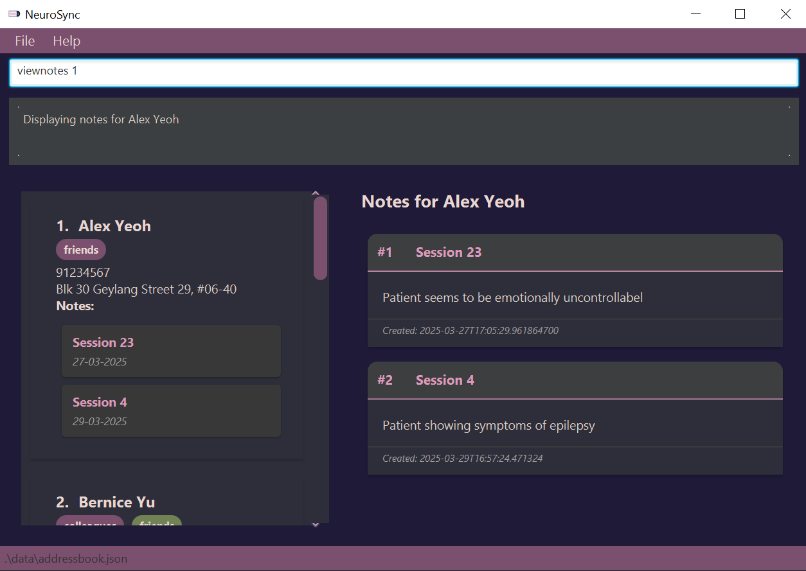

⚠️ **Warning:** If a patient has many notes, it may take a moment to load.<br>
💡 **Tip:** Use [Filter Notes](#filtering-notes) to narrow down results if you have many notes.

[🔝 Back to Top](#table-of-contents)

---
<div style="page-break-after: always;"></div>

### **Filtering Notes** {#filtering-notes}
To see specific notes for one patient!

```bash
filternote INDEX nt/TITLE_KEYWORD
```

**Example:**

```bash
filternote 1 nt/23
```

✔️ **Expected Output:**

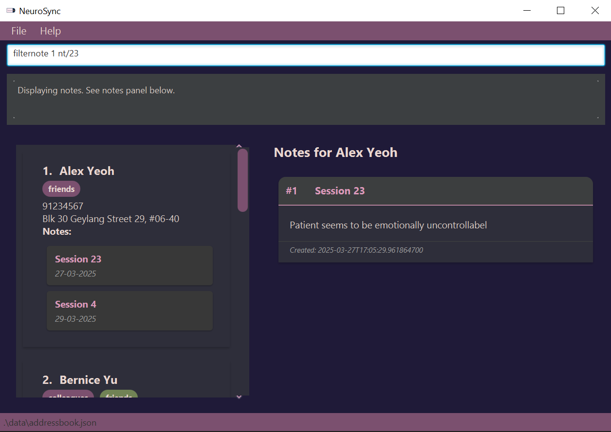


⚠️ **Warning:** Be specific with keywords to avoid too many results.<br>
💡 **Tip:** Keywords should be part of the note's title for better results.

[🔝 Back to Top](#table-of-contents)

---
<div style="page-break-after: always;"></div>

### **Adding a Note** {#adding-a-note}
You can add notes to a patient to keep track of discussions, diagnoses, etc.<br>
Duplicate note titles (case-insensitive) are not allowed.

```bash
note INDEX nt/TITLE nc/CONTENT
```

**Example:**

```bash
note 2 nt/Mood Assessment nc/Discussed mood swings and coping strategies.
```

✔️ **Expected Output:**

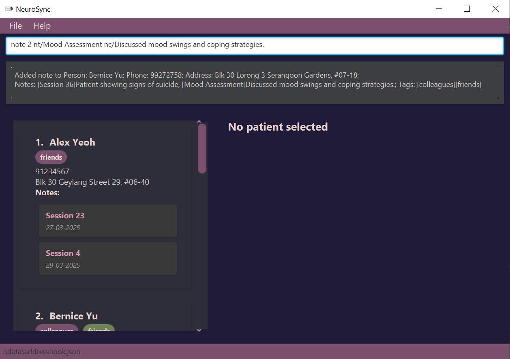

<div style="page-break-after: always;"></div>
View the changes after:


  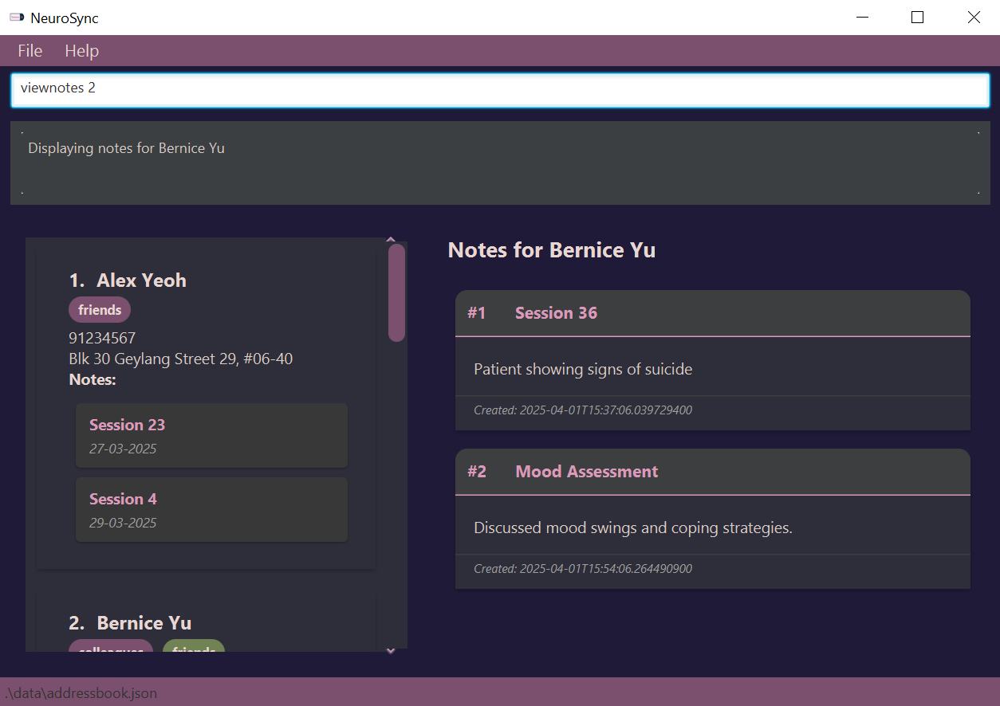

💡 **Tip:** Keep notes short and concise, highlighting the most important aspects.

[🔝 Back to Top](#table-of-contents)

---
<div style="page-break-after: always;"></div>

### **Editing a Note** {#editing-a-note}
You can always make changes to your **note content** after creating it, using the `editnote` command!

```bash
editnote INDEX nt/TITLE nc/CONTENT
```

**Example:**

```bash
editnote 2 nt/Mood Assessment nc/Patient showed signs of suicide. Discussed mood swings and coping strategies.
```

✔️ **Expected Output:**

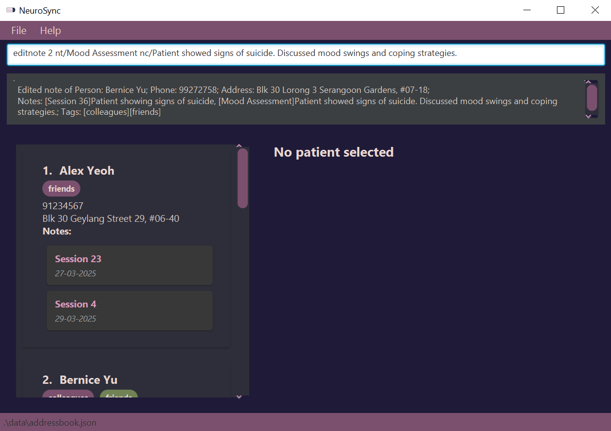

<div style="page-break-after: always;"></div>
View the changes after:

  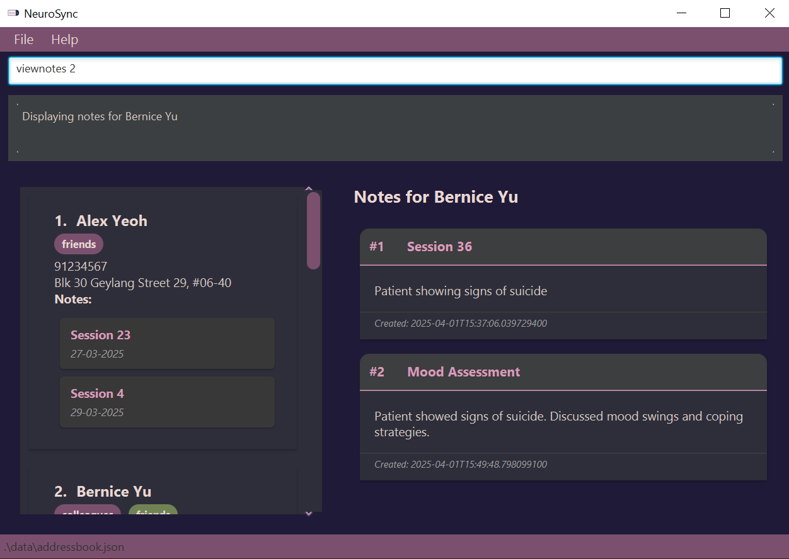


💡 **Tip:** You can only edit the **note content**. If you wish to change a note title, you can [delete a note](#deleting-a-note) and [add a new note](#adding-a-note) with the changed title!


[🔝 Back to Top](#table-of-contents)

---
<div style="page-break-after: always;"></div>

### **Deleting a Note** {#deleting-a-note}
If you no longer need a note, you can delete it using the `deletenote` command.

```bash
deletenote INDEX nt/TITLE
```

**Example:**

```bash
deletenote 2 nt/Mood Assessment
```

✔️ **Expected Output:**


<div style="page-break-after: always;"></div>
View the changes after:


  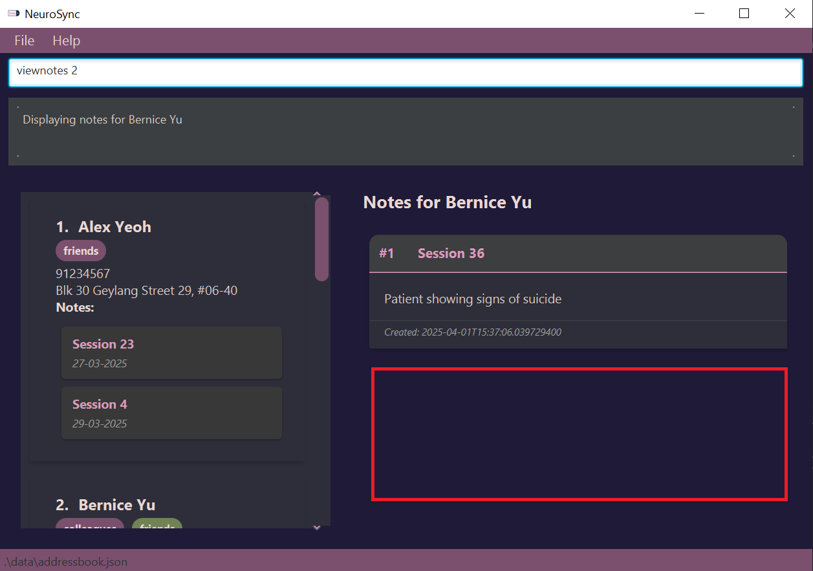

💡 **Tip:** Keep backups if needed.

[🔝 Back to Top](#table-of-contents)

---
<div style="page-break-after: always;"></div>

### **Undo** {#undo}
If you made a mistake, don't stress! You can **undo your previous change** using this command.

**Example (following the example in `deletenote`):**

```bash
undo
```

✔️ **Expected Output:**


<div style="page-break-after: always;"></div>
View the changes after:

  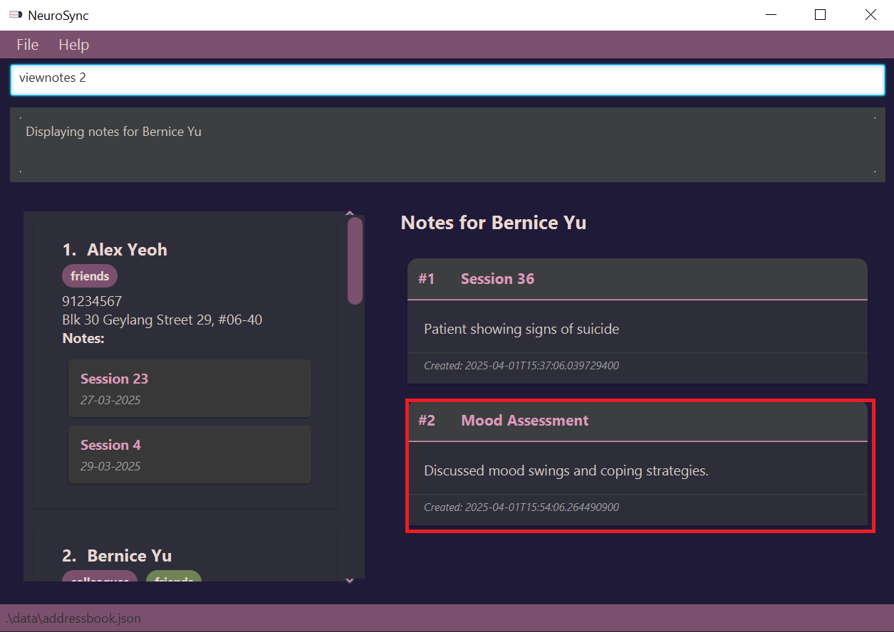


[🔝 Back to Top](#table-of-contents)

---
<div style="page-break-after: always;"></div>

### **Redo** {#redo}
If you need to get back a change you undid, don't stress! You can **redo your previous change** using this command.

**Example (following the example in `undo`):**

```bash
redo
```

✔️ **Expected Output:**

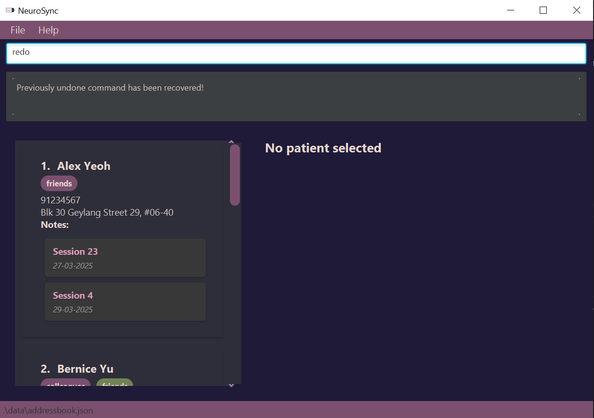

<div style="page-break-after: always;"></div>
View the changes after:


  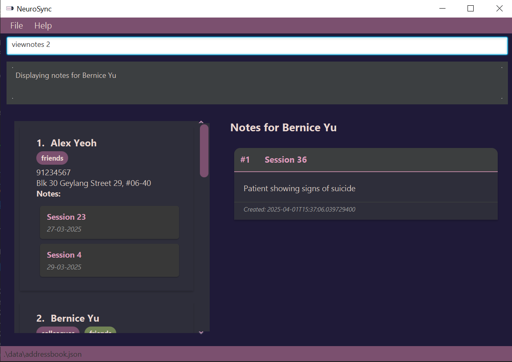


[🔝 Back to Top](#table-of-contents)

---
<div style="page-break-after: always;"></div>

### **Clear All Data** {#clear-data}
⚠️ **Warning:** Use with caution! This will instantly remove all data.<br>

**Example:**

```bash
clear
```

✔️ **Expected Output:**

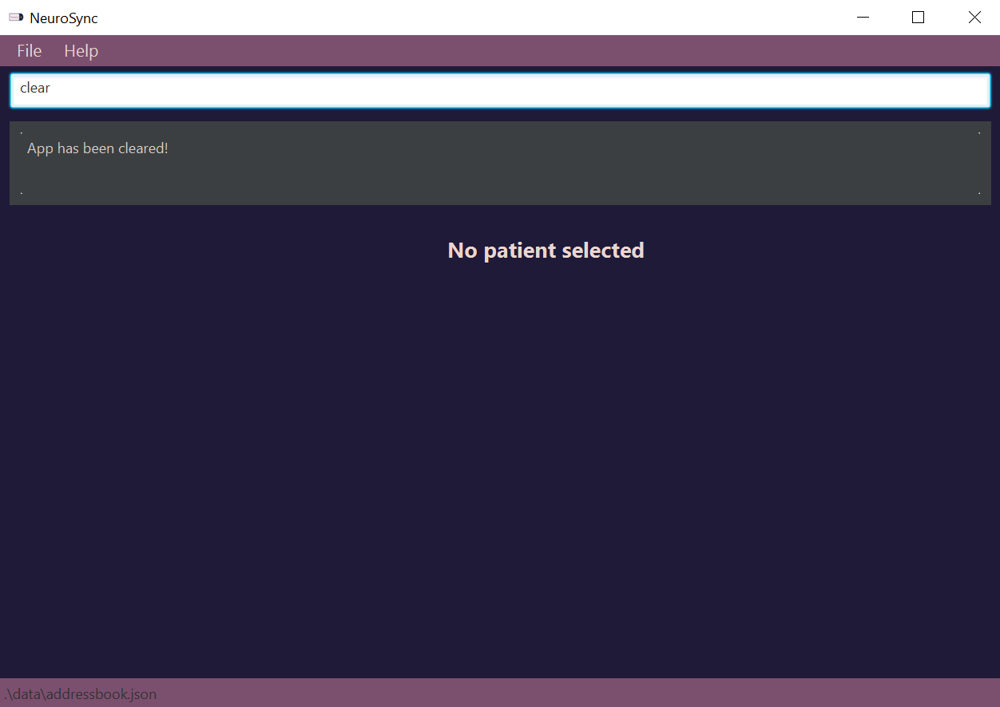

💡 **Tip:** You can recover your lost data using the **undo** command.

[🔝 Back to Top](#table-of-contents)

---
<div style="page-break-after: always;"></div>

### **Help** {#help}
Opens a pop-up to give you the link to this User Guide

**Example:**

```bash
help
```

✔️ **Expected Output:**

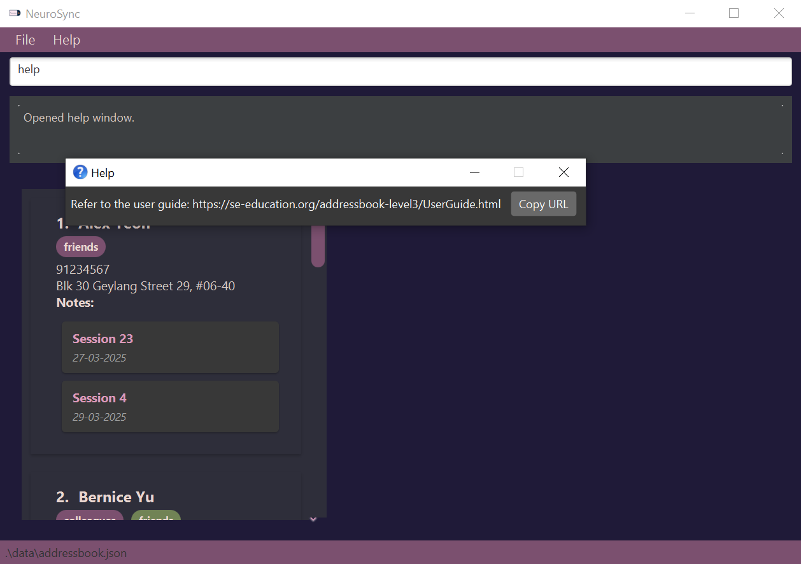

💡 **Tip:** Use **help** if you forget a command.

[🔝 Back to Top](#table-of-contents)

---
<div style="page-break-after: always;"></div>

## ❓ **FAQs & Troubleshooting** {#faqs--troubleshooting}

**Q: Where is my data stored?**
**A:** Your data is saved in `addressbook.json` inside the `/data` folder.<br>
⚠️ **Warning:** Please do not modify `addressbook.json` as there could be unpredictable effects.<br>

**Q: Can I undo a deletion?**
**A:** Yes! There is an [undo](#undo) feature, to recover data or undo edits.

**Q: How do I transfer data to another device?**
**A:** Copy the `addressbook.json` file from `/data` and paste it into the same directory on the new device.


[🔝 Back to Top](#table-of-contents)

---

## 🙌 Acknowledgements {#acknowledgements}

This project is based on the AddressBook-Level3 project by the SE-EDU initiative.

Visit [se-education.org](https://se-education.org) for more open-source CS education projects.

[🔝 Back to Top](#table-of-contents)

---

## 📬 Contact & Support {#contact-support}

For issues and contributions, please raise an issue or pull request in the [GitHub repository](https://github.com/AY2425S2-CS2103T-F13-1/tp).

[🔝 Back to Top](#table-of-contents)

🚀 _Enjoy using NeuroSync!_
