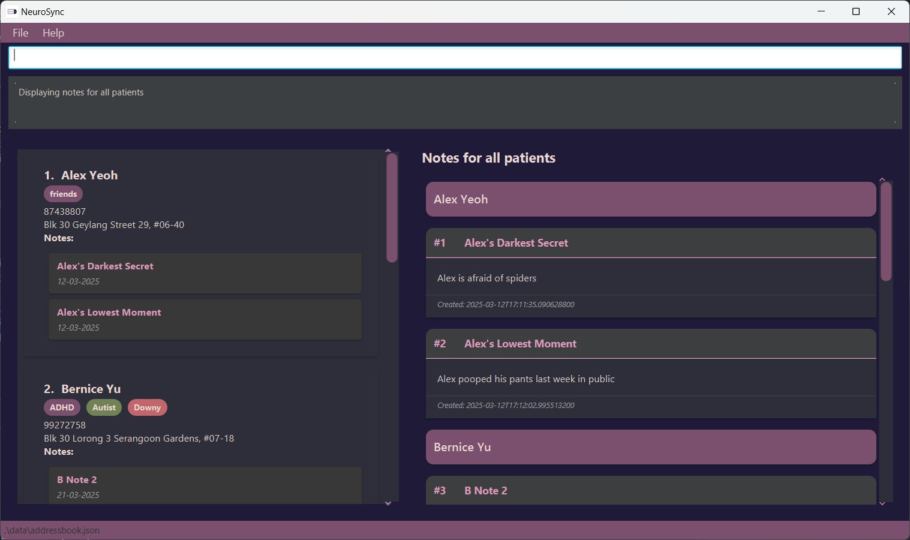

**NeuroSync: All-In-One App for Psychiatrists!**

NeuroSync is a powerful, user-friendly desktop application that helps psychiatrists to keep track of patients’ contacts, details and notes from their sessions. No more searching through thick files of paper, just search by name and get everything you need in seconds.

* If you are interested in using NeuroSync, head over to the [_Quick Start_ section of the **User Guide**](UserGuide.html#quick-start).
* If you are interested about developing NeuroSync, the [**Developer Guide**](DeveloperGuide.html) is a good place to start.

**Acknowledgements**

* Libraries used: [JavaFX](https://openjfx.io/), [Jackson](https://github.com/FasterXML/jackson), [JUnit5](https://github.com/junit-team/junit5)
